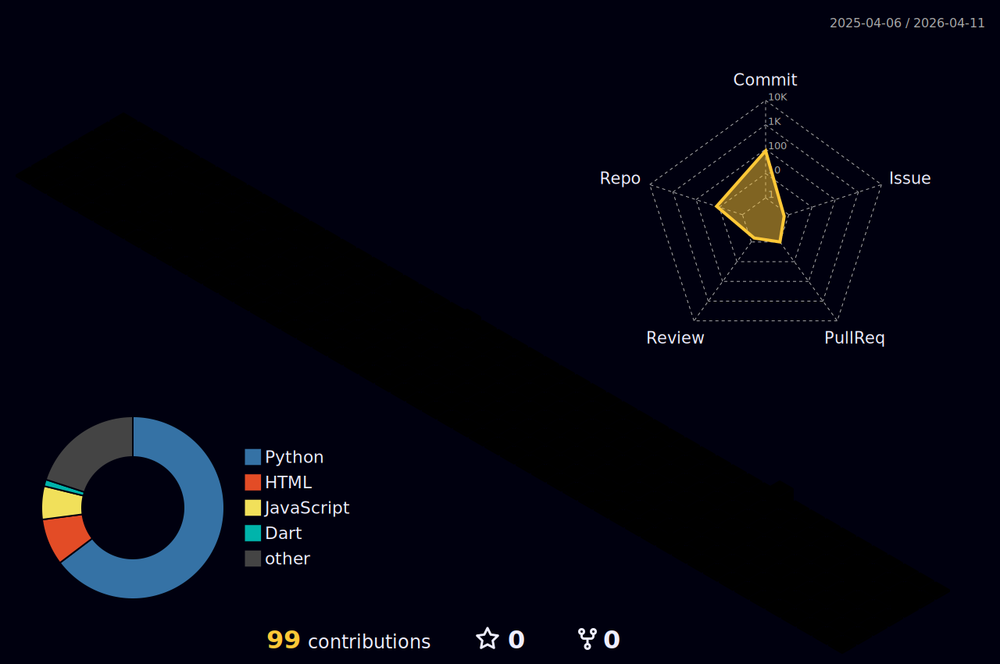

<div align="center">
  


[](https://git.io/typing-svg)

[](https://www.linkedin.com/in/kjhk3082/)
[](https://github.com/kjhk3082)

</div>

---

## 🧑‍💻 About Me

```javascript
const jaeHyung = {
    name: "Kim Jae Hyung (김재형)",
    role: ["Full-Stack Developer", "AI Engineer"],
    location: "South Korea 🇰🇷",
    interests: ["AI/ML", "Web Dev", "Mobile", "Computer Vision"],
    motto: "Sweat saves blood, blood saves lives, and brains save both."
};
```

---

## 🛠 Tech Stack

<div align="center">

|Frontend|Backend|Mobile|
|:---:|:---:|:---:|
||||

|Languages|AI / ML|Database|
|:---:|:---:|:---:|
||||

|DevOps & Tools|
|:---:|
||

</div>

---

## 📊 GitHub Stats

<div align="center">
  
</div>

<div align="center">
  
  
  
</div>

<div align="center">
  
  
</div>

---

## 🏅 Baekjoon

<div align="center">
  
  
</div>

---

## 🏙️ 3D Contribution

<div align="center">
  
</div>

---

## 📈 Activity Graph

<div align="center">
  
</div>

---

## 📫 Contact

<div align="center">

<a href="https://github.com/kjhk3082"></a>
<a href="https://www.linkedin.com/in/kjhk3082/"></a>
<a href="mailto:kjhk3082@gmail.com"></a>

</div>

---

<div align="center">

### ⚔️ *"Sweat saves blood, blood saves lives, and brains save both."* — Rommel

</div>


